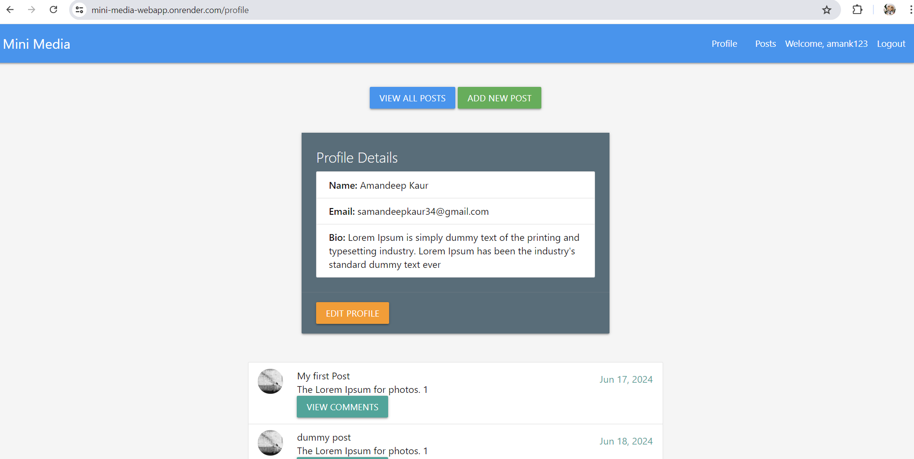
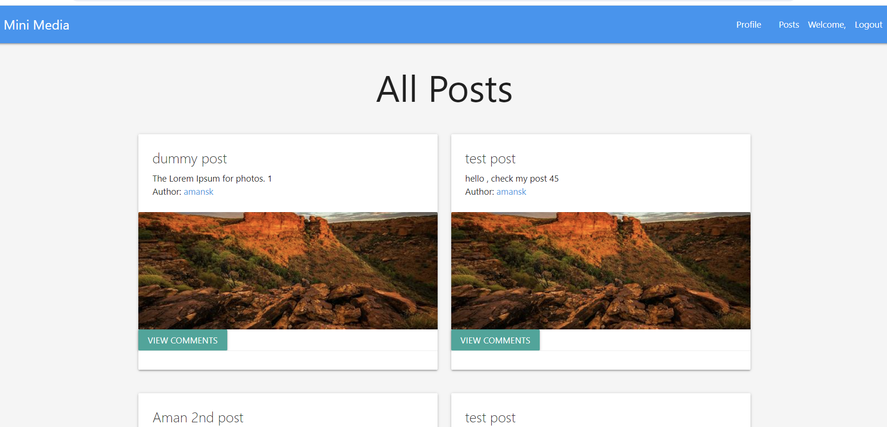

## Minimedia

## User Story

As a registered user of the web application,
I want to have the ability to connect and interact only with people I know,
So that I can maintain my privacy and ensure my personal data is secured.

## Functionality

WHEN the app started it will show the page to either REGISTER(for new user) or LOGIN
IF you are already a user, login with email and password
IF you are a new user, register with the link in header
WHEN you are ready to register
THEN you just need to fill simple information about yourself such as: name, username, DOB
WHEN you are done with register and login
THEN you will find your profile page where you will see you information and posts you added
WHEN you look at the header
THEN you will see some links to visit different pages
ALSO the profile page has links to add your page or view all the posts
WHEN you enter the add post page
THEN you will be given your personal space to share whatever you want

## Technologies Used

- Node.js
- Express.js
- Handlebars.js
- PostgreSQL
- Sequelize ORM
- Express-session for session management
- Render for deployment

   ## Installation 
  To install necessary dependencies, run the following command:

   npm i

## UI Library
Materializecss

## Screenshots

## License 
  This project is licensed under MIT license  

## Group

 Conrtibution: 

[Amandeep Kaur sandhu](https://github.com/amandeepsandhu13).

[UDIT SACHDEVA](https://github.com/usachdeva).

[jaquelineesteves](https://github.com/jaquelineesteves/).

[Xavier Andrés Mendoza](https://github.com/MaixusBetter).

[Alexis Brown-Renshaw](https://github.com/KatLeviathan).

## Deployed Link
https://mini-media-webapp.onrender.com

